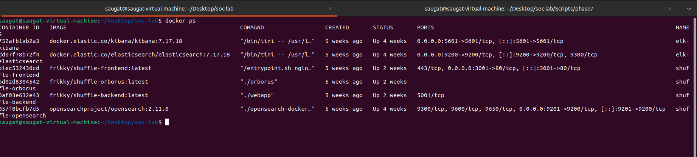
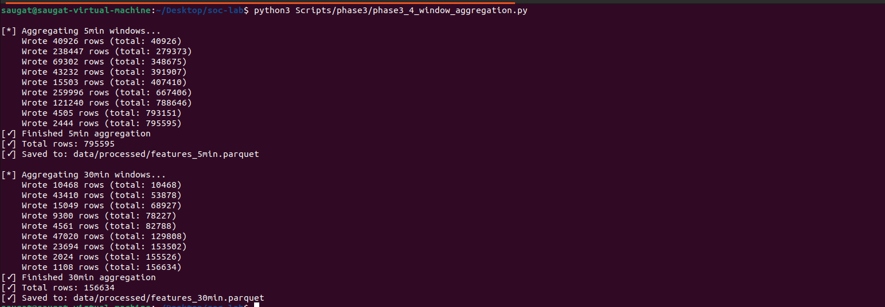
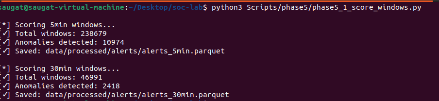
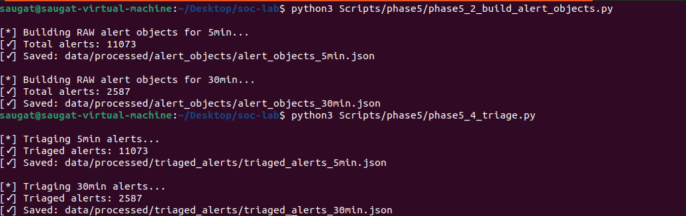
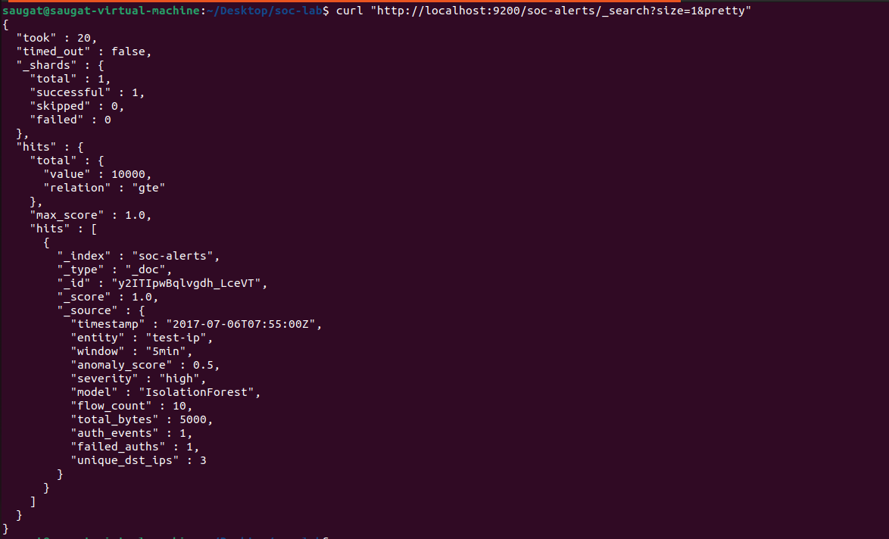
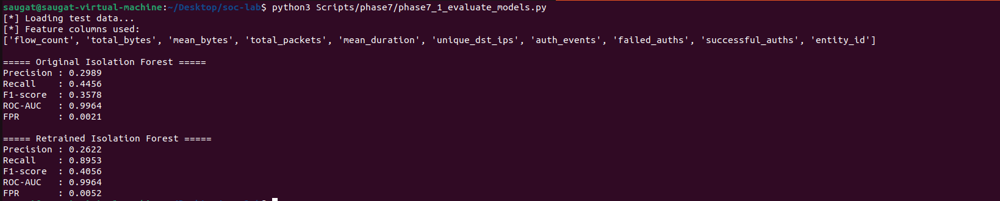

# Semi-Autonomous SIEM–SOAR Framework with Human-in-the-Loop Learning

<p align="center">
  
</p>

<p align="center">
  
  
  
  
  
  
</p>

---

# Overview

This project implements a **semi-autonomous Security Operations Center (SOC) prototype** integrating:

- Machine learning-based anomaly detection
- SIEM-style centralized alert management
- SOAR-assisted orchestration
- Human-in-the-loop analyst validation
- Offline retraining workflows

The framework processes network flow telemetry and authentication logs, generates behavioral features using sliding time windows, detects anomalies using Isolation Forest, enriches alerts, indexes alerts into Elasticsearch/Kibana, and incorporates analyst feedback into periodic retraining cycles.

This work was developed as a cybersecurity research prototype for anomaly-based SOC operations.

---

# Key Features

## Security Data Processing
- Network flow log ingestion
- Authentication telemetry ingestion
- Schema unification
- Sliding window feature engineering
- Behavioral aggregation (5 min / 30 min)

## Machine Learning Detection
- Isolation Forest anomaly detection
- Baseline-only unsupervised learning
- Temporal train/test split
- Threshold tuning and anomaly scoring

## Detection & Triage Pipeline
- Alert object generation
- Severity-based triage engine
- Contextual alert enrichment
- Simulated MITRE ATT&CK mapping

## SIEM Integration
- Elasticsearch alert indexing
- Kibana dashboard visualization
- Centralized alert investigation

## SOAR Integration
- Shuffle SOAR webhook integration
- Semi-automated playbook triggering
- Analyst notification workflows

## Human-in-the-Loop Learning
- Analyst feedback collection
- True positive / false positive labeling
- Offline retraining pipeline
- Updated baseline generation

---

# System Architecture

<p align="center">
  
</p>

The framework follows a semi-autonomous SOC workflow:

```text
Security Logs
      ↓
Data Ingestion & Preprocessing
      ↓
Sliding Window Aggregation
      ↓
Isolation Forest Detection Engine
      ↓
Alert Enrichment & Triage
      ↓
Elasticsearch + Kibana
      ↓
Shuffle SOAR
      ↓
Human Analyst Feedback
      ↓
Offline Model Retraining
```

---

# Technology Stack

| Component | Technology |
|---|---|
| Programming Language | Python 3.10+ |
| Data Processing | pandas, numpy |
| Machine Learning | scikit-learn |
| Detection Model | Isolation Forest |
| SIEM Stack | Elasticsearch, Kibana |
| SOAR Platform | Shuffle SOAR |
| APIs | Flask REST API |
| Containerization | Docker |
| Storage Format | Parquet / JSON |

---

# Repository Structure

```text
soc-lab/
│
├── Scripts/
│   ├── phase3/
│   ├── phase4/
│   ├── phase5/
│   ├── phase6/
│   ├── phase7/
│   └── phase8/
│
├── architecture/
├── screenshots/
├── docs/
├── elk/
├── shuffle/
├── data/
│   ├── raw/
│   ├── processed/
│   └── models/
│
├── requirements.txt
├── README.md
├── LICENSE
└── .gitignore
```

---

# Detection Pipeline Screenshots

## Dockerized ELK + Shuffle Infrastructure

<p align="center">
  
</p>

---

## Behavioral Window Aggregation

<p align="center">
  
</p>

---

## Isolation Forest Anomaly Detection

<p align="center">
  
</p>

---

## Alert Generation & Triage

<p align="center">
  
</p>

---

## Elasticsearch Alert Indexing

<p align="center">
  
</p>

---

## Model Evaluation Results

<p align="center">
  
</p>

---

# Installation

## Clone Repository

```bash
git clone https://github.com/saugat50/soc-lab.git

cd soc-lab
```

---

## Create Virtual Environment

### Linux / macOS

```bash
python3 -m venv venv

source venv/bin/activate
```

### Windows

```bash
python -m venv venv

venv\Scripts\activate
```

---

## Install Dependencies

```bash
pip install -r requirements.txt
```

---

# Running the Project

## Start Elasticsearch

```bash
cd elk
sudo docker compose up -d
```

Verify:

```bash
curl http://localhost:9200
```

---

## Start Kibana

```bash
sudo systemctl start kibana
```

Open:

```text
http://localhost:5601
```

## Start shuffle

```bash
cd shuffle
sudo docker compose up -d
```

Open:

```text
http://localhost:3001
```

---

# Detection Workflow

## Step 1 — Sliding Window Aggregation

```bash
python3 Scripts/phase3/phase3_4_window_aggregation.py
```

---

## Step 2 — Train Isolation Forest

```bash
python3 Scripts/phase4/phase4_2_train_isolation_forest.py
```

---

## Step 3 — Score Behavioral Windows

```bash
python3 Scripts/phase5/phase5_1_score_windows.py
```

---

## Step 4 — Build Alert Objects

```bash
python3 Scripts/phase5/phase5_2_build_alert_objects.py
```

---

## Step 5 — Apply Triage

```bash
python3 Scripts/phase5/phase5_4_triage.py
```

---

## Step 6 — Push Alerts to Elasticsearch

```bash
python3 Scripts/phase5/phase5_6_push_to_elasticsearch.py
```

---

# Human Feedback Channel

Start analyst feedback server:

```bash
python3 Scripts/phase6/feedback_server.py
```

The feedback channel supports:
- True positive labeling
- False positive labeling
- Feedback logging
- Offline retraining preparation

---

# Model Evaluation Results

| Model | Precision | Recall | F1-score | ROC-AUC | FPR |
|---|---|---|---|---|---|
| Original Isolation Forest | 0.2989 | 0.4456 | 0.3578 | 0.9964 | 0.0021 |
| Retrained Isolation Forest | 0.2622 | 0.8953 | 0.4056 | 0.9964 | 0.0052 |

### Key Observations

- Retraining significantly improved recall
- Higher sensitivity increased alert volume
- Results demonstrate realistic SOC detection trade-offs
- Human feedback improved anomaly detection adaptability

---

# Research Publication

This project is associated with an accepted research publication in the Scopus-indexed Springer book series:

### Lecture Notes in Networks and Systems (LNNS)

**Paper Title:**  
*Semi-Autonomous SIEM–SOAR Framework with Human-in-the-Loop Learning*

---

# Future Improvements

Potential future enhancements include:

- Streaming log ingestion using Kafka
- Real-time feedback adaptation
- Threat intelligence integration
- Deep learning-based anomaly detection
- Real-time alert correlation
- EDR integration
- Multi-tenant SOC support
- Online learning pipelines

---

# Limitations

This project is a research prototype and has several limitations:

- Uses CICIDS-style research telemetry
- No production deployment validation
- No destructive SOAR actions
- MITRE ATT&CK mapping is simulated
- No live threat intelligence feeds
- No online learning pipeline

---

# Author

**Saugat Chaudhary**  
B.Tech Cybersecurity  
Machine Learning for Security • SIEM/SOAR • SOC Automation

---

# License

This project is released for academic and research purposes under the MIT License.